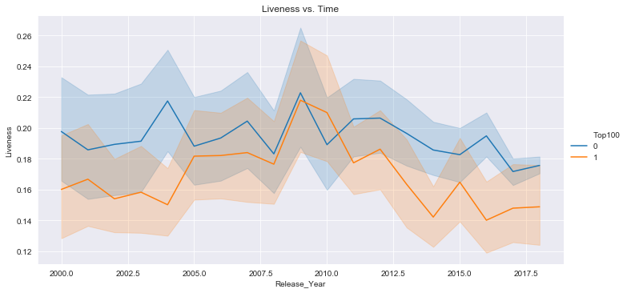
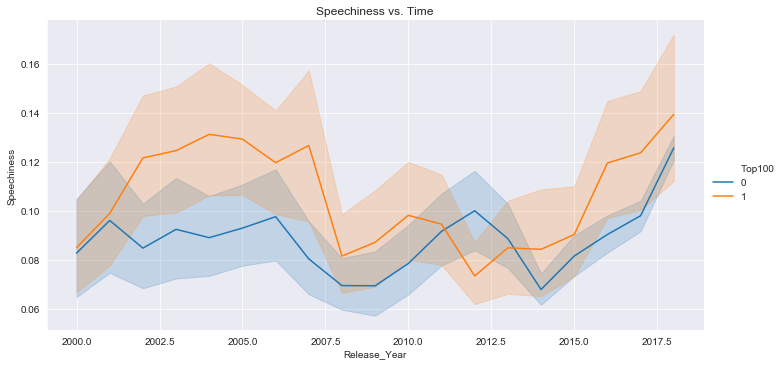

# Billboard Hot 100 Hit Prediction
Predicting Billboard's Year-End Hot 100 Songs using audio features from Spotify and lyrics from Musixmatch

## Overview
Each year, Billboard publishes its Year-End Hot 100 songs list, which denotes the top 100 songs of that year. The objective of this project was to see whether or not a machine learning classifier could predict whether a song would become a hit *([Hit Song Science](https://en.wikipedia.org/wiki/Hit_Song_Science))* given its intrinsic audio features as well as lyrics.

## Data & Features
A sample of 19000 Spotify songs was downloaded from [Kaggle](https://www.kaggle.com/edalrami/19000-spotify-songs), which included songs from various Spotify albums. Additionally, Billboard charts from 1964-2018 were scraped from Billboard and Wikipedia.

Using Spotify's Audio Features & Analysis API, the following [features](https://developer.spotify.com/documentation/web-api/reference/tracks/get-audio-features/) were collected for each song: 
- **Mood**: Danceability, Valence, Energy, Tempo
- **Properties**: Loudness, Speechiness, Instrumentalness
- **Context**: Liveness, Acousticness

Additonally, lyrics were collected for each song using the [Musixmatch API](https://developer.musixmatch.com/documentation/api-reference/track-lyrics-get). I took a bag-of-words NLP approach to build a highly sparse (86%) matrix of unique words.

After cleaning the data, a dataset of approx. 10000 songs was created.

## Exploratory Data Analysis

**Spotify Features over Time**

The above graphs clearly show that audio features evolve over time. More importantly, the separability of data in certain graphs such as *Acousticness vs. Time* and *Loudness vs. Time* indicates potentially significant features that can help distinguish between the two classes.

**Feature Comparisons**

The above graphs show the separability in the data when compared across two unique Spotify features; this suggests that data may separate across an n-dimensional feature space. Given this, the problem can alternatively be posed as an unsupervised learning problem where clustering methods can classify the data.
